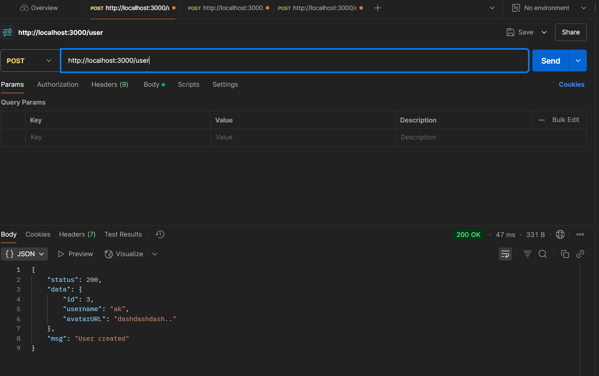
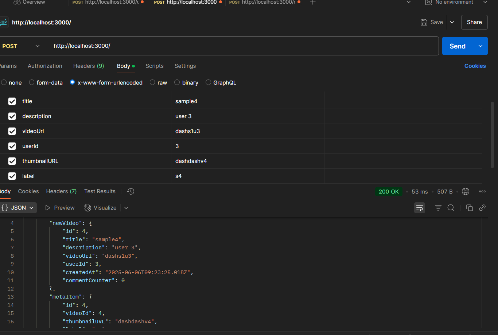
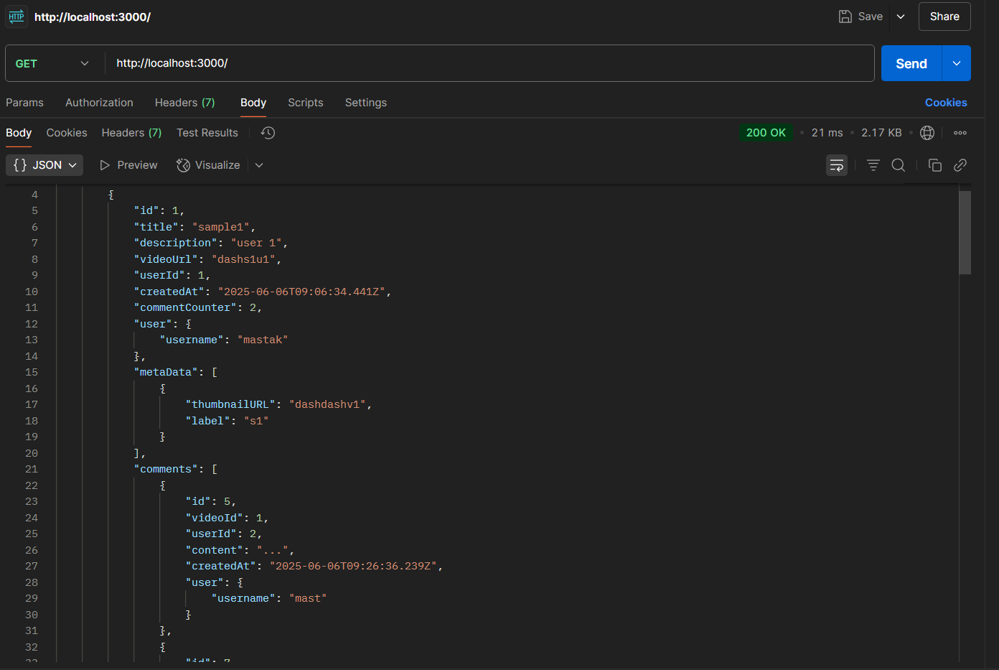
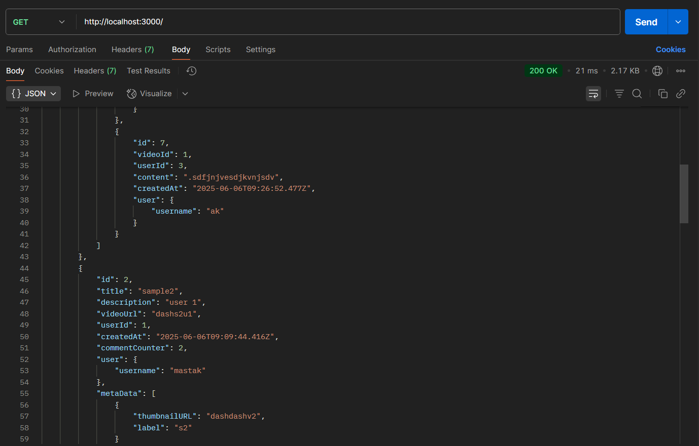
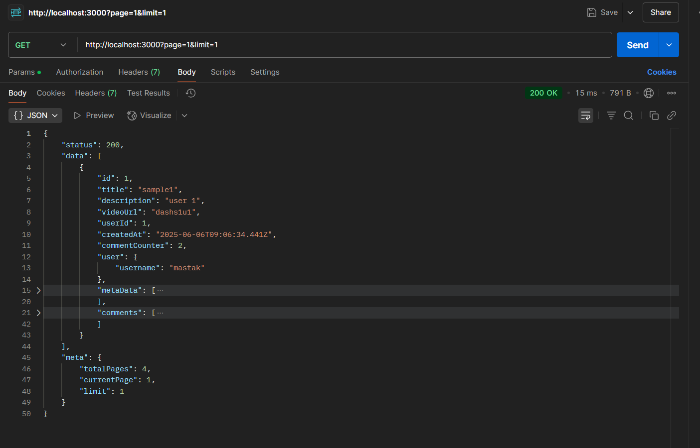
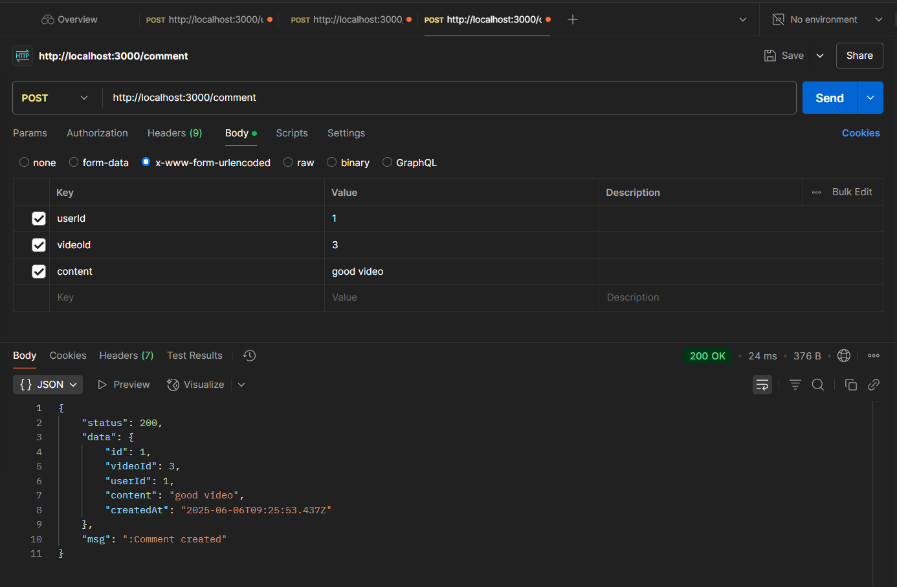

# Tech Stack
- Node.js + Express.js
- Prisma ORM
- PostgreSQL

# Folder Structure

```
├── assets/                    
│
├── Controller/              
│   ├── commentController.js
│   ├── getController.js
│   ├── postController.js
│   └── userController.js
│
├── DB/                    
│   └── db.config.js        
│
├── prisma/                   
│   ├── migrations/
│   └── schema.prisma
│
├── routes/                 
│   ├── commentRoutes.js
│   ├── getRoutes.js
│   ├── index.js
│   ├── postRoutes.js
│   └── userRoutes.js
│
├── .gitignore            
├── index.js                  
├── package.json            
├── package-lock.json      
└── README.md            

```

# API endpoints

## /user
### POST /
#### Allows to add a user to the database
### GET /
#### Gets all the users from the database
### GET /:id
#### Gets user with id = (req.params.id)




## POST /
### allows to create a new video into the database


## GET /
### gets all the videos with their users and meta datas



## Pagination
- query parameters : limit and page
- sample : http://localhost:3000?limit=10&page=2
- would display video no 11 to 20
---


## Comments
- POST /comments
- requires userId, videoId and content
---
